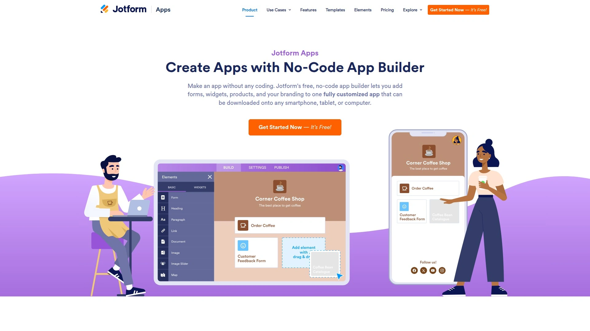

# No More Coding Headaches! 9 No-Code App Builder Tools Recommended!

So, you have a brilliant idea for an app but the thought of hiring developers or learning to code makes your wallet ache and your brain fizzle out. Welcome to the club. The good news is, creating powerful custom business apps or client portals is no longer a secret art reserved for tech wizards. With a solid no-code app builder, you can turn a simple spreadsheet into a fully functional app, often in less time than it takes to finish a season of your favorite show.

## **[Glide](https://www.glideapps.com)**

Glide is the go-to platform for turning spreadsheets and other data sources into beautiful, data-driven apps with stunning speed.

This tool is a game-changer if your data lives in Google Sheets, Airtable, or Excel. Glide reads your data and instantly generates a working app with a clean, professional interface. It's incredibly intuitive, making it perfect for building internal tools, employee directories, project trackers, and simple customer portals. You're not just building a static display; you can allow users to add, edit, and interact with the data, which writes back to your source in real-time.

* **User Experience:** One of the smoothest and fastest onboarding experiences. You can have a prototype running in minutes.
* **Best For:** Teams that need custom internal tools, inventory managers, and client-facing portals built directly from their existing data.
* **Key Feature:** The real-time synchronization with data sources is seamless.

## **[Bubble](https://bubble.io)**

Bubble is a beast of a no-code platform that lets you build complex, interactive web applications with complete design freedom.

Think of Bubble as a visual programming language. If you can dream up a complex workflow, chances are you can build it here. It's not just for simple apps; you can create marketplaces, social networks, and sophisticated SaaS products. It has a steeper learning curve than Glide but offers unparalleled power and flexibility for web app development without writing a single line of code.

* **Technical Advantages:** Full control over app logic, database management, and third-party API integrations.
* **Target Users:** Entrepreneurs, startups, and developers who want to build and launch feature-rich web products quickly.

## **[Softr](https://www.softr.io)**

Softr empowers you to build beautiful client portals and internal tools from your Airtable or Google Sheets data, no code required.

Similar to Glide, Softr excels at transforming your existing data into functional applications. Where it really shines is in its pre-built, customizable blocks that allow you to construct websites, member-only portals, and online communities with ease. The design is sleek and modern, and the integration with platforms like Stripe and Memberstack makes monetizing your creation straightforward.

* **Core Functions:**
  * Gated content and user-specific permissions.
  * Dynamic lists and search functionality.
  * Clean, responsive, and highly customizable templates.

## **[Adalo](https://www.adalo.com)**

Adalo is a drag-and-drop app builder that allows you to create true native mobile apps and publish them to the Apple App Store and Google Play.

While many platforms focus on web apps, Adalo is all about building mobile-first experiences. You visually design your app by dragging components onto screens and then connect them to a built-in database or an external API. It strikes a fantastic balance between ease of use and the power to create a legitimate, publishable mobile app.

* **Recommendation Reason:** It’s one of the most accessible ways to build and launch a real native app without involving a development team.
* **Applicable Scenarios:** Creating simple e-commerce apps, booking systems, or community platforms for mobile users.

## **[Webflow](https://webflow.com)**

Webflow is a design-first platform for building professional, custom websites that can have complex app-like functionality.

While primarily a website builder, Webflow's capabilities blur the line between a site and an application. With its powerful CMS, membership features, and logic workflows, you can build everything from marketing sites to full-fledged web apps. It's the top choice for designers who want granular control over every animation and interaction without touching code.

* **Differentiation:** Unmatched visual design control. What you design is exactly what you get.
* **Pricing:** Offers a range of plans, from a free tier for getting started to enterprise-level solutions.

## **[Appy Pie](https://www.appypie.com)**

Appy Pie offers a guided, step-by-step process for creating a wide variety of apps without any technical knowledge.

This platform is designed for maximum simplicity. You select an app category (like a restaurant or a radio station), pick a template, and then add the features you need from a list. It’s a bit like assembling an app from pre-made LEGO bricks. While it offers less customization than Bubble or Webflow, its speed and ease of use are perfect for small businesses needing a standard mobile presence.

* **Onboarding:** The platform walks you through the entire creation process, making it very beginner-friendly.
* **Core Value:** A fast and simple way to get an app built for common business use cases.

## **[Jotform Apps](https://www.jotform.com/products/apps/)**

Jotform Apps allows you to bundle forms, widgets, and other elements into a single, shareable app that works on any device.

If your primary need is data collection, Jotform Apps is a fantastic tool. You can create apps for internal surveys, event registration, team reports, or order forms. It's not for building a social network, but for centralizing form-based workflows into a simple app interface, it's incredibly efficient and easy to use.

* **Best For:** Organizations that rely on forms for their daily operations and want to streamline the user experience.

## **[Zoho Creator](https://www.zoho.com/creator/)**

Zoho Creator is a low-code platform that helps you build custom, scalable business applications for your specific operational needs.

As part of the massive Zoho ecosystem, Creator is a natural fit for businesses already using Zoho's suite of products (like their CRM or Books). It goes beyond simple no-code, offering low-code capabilities for more complex logic and integrations. You can build powerful, multi-device apps to automate processes and manage data across your entire organization.

* **Technical Advantages:** Strong integration with the Zoho suite and robust tools for process automation.
* **Target Users:** Medium to large businesses seeking to build custom internal applications to solve unique workflow challenges.

## **[Carrd](https://carrd.co)**

Carrd is the master of simplicity, enabling anyone to build beautiful, responsive one-page sites for pretty much anything.

Though it's marketed for single-page websites, Carrd's functionality can easily be used to create simple web apps, portfolios, or landing pages that function as a centralized hub. It's ridiculously easy to use and incredibly affordable. If you just need a simple, elegant online presence with forms or buttons, you can build and launch it in under an hour.

* **User Experience:** The simplest and most intuitive builder on this list.
* **Cost Consideration:** Extremely cost-effective, with a generous free plan and very low-priced pro plans.

## **FAQ**

**Can I really build a useful app with zero coding knowledge?**
Absolutely. These no-code app builder platforms are designed around visual, drag-and-drop interfaces, so you're focused on design and logic, not syntax.

**How do I choose the best tool for my project?**
Start by defining your core need. Is it data-driven (Glide, Softr)? Is it a complex web app (Bubble)? Or a native mobile app (Adalo)? Your goal will point you to the right tool.

**What happens if my app becomes very successful and I need to scale?**
Most leading platforms like Bubble and Webflow are built on scalable infrastructure. For others, they provide ways to export your data so you can move to a custom-coded solution if you ever outgrow them.

## **Conclusion**

The power to build your own digital tools is now in your hands, no computer science degree required. Each of these platforms offers a unique path from idea to reality. If your goal is to quickly build a polished, functional app from your existing data for internal teams or customers, **[Glide](https://www.glideapps.com)** is an exceptional choice because its data-first approach eliminates enormous amounts of work and gets you to a finished product faster than almost any other tool.
